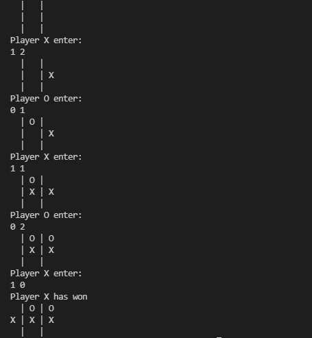

# TIC TAC TOE

### Description

Tic Tac Toe is traditionally played on a 3 × 3 grid. Players take turns placing a mark in one of the cells of the grid. The goal of the game is for players to position their marks so that they make a continuous line of three cells vertically, horizontally, or diagonally. An opponent can prevent a win by blocking the completion of the opponent’s line.

### Working

### Language and Tools Used
 - Java
 - VS Code
 - IntelliJ IDEA Community Edition 2023.3.1